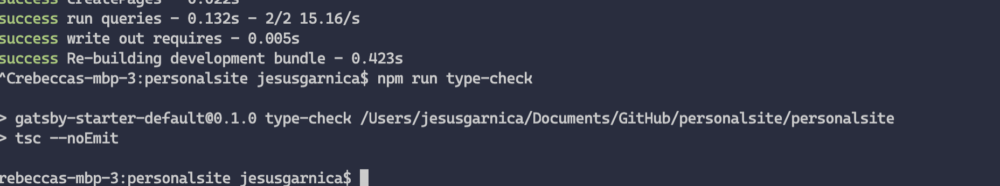
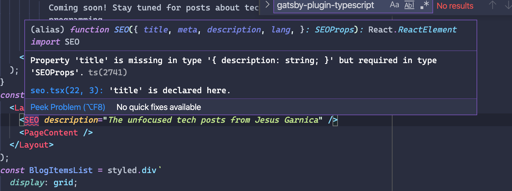

### JavaScript: "11" + 1 = 111 and "11" - 1 = 10

I have been working with GatsbyJS for a while now, utilizing it to quickly create
sites with relative ease, but until recently I have always used it with Javascript.
This worked for a while, but the more components I created, the more I have realized
what a time sink plain JS is. The sheer volume of documentation and type guards
necessary to write even moderately complex components was becoming a drain on my productivity,
so I figured that quarantine was a great time to try to learn something new:
~~how to bake sourdough~~ TypeScript. I recently added
TypeScript to la salsa for this website and I wish I had done it so much sooner.

Although I completed many group projects in Javascript during my time in university,
TypeScript was only ever mentioned briefly, like some mythical code creature that
required the privilege of excess time. We knew that it had the potential to save
time and effort in the long run, but it was always passed over for fear that
taking the time to learn it would slow down whatever project was at hand. We
were typically working against the clock, occasionally with classmates who had never touched
React or a modern library (jQuery please leave the room) for front-end web
development. Pushing people with primary experience in C++ and Java to learn
TypeScript at the same time as React was too much to handle,
so we stuck to JS.

For some of our team members, these web development projects were their first time using a split up codebase. Inexperience with collaborative development lead to libraries of React components with sparse documentation, causing constant back and forth debates about what a certain component was called or how it was supposed to be used:

> "Where are the types?!"

> "What am I supposed to pass in to this component?"

> "Why is it crashing, does it need props?"

This was my introduction to working with JS and React, and it was _chaos_. To make
sense of the madness, I learned to be strict about documenting every step, using
type guards, creating warnings for incorrect parameter types, setting defaults
everywhere, and implementing lots of try-catches. However, the human
capacity for making truly _innovative_ type errors is unparalleled (especially when programming
at 3 AM with the fourth cup of coffee).

Fast forward to this April, I figured that now was the time to take some time to
save some time. I wanted static typing back.

I have been working with TypeScript for a few months now, and I invite you to
join the opulent TypeScript lifestyle. Adding TypeScript into my GatsbyJS project
did not take long at all and I highly recommend giving it a try. As I am still
no expert, I don’t intend for this to be a full tutorial, but instead a general
guide for anyone getting started.

### Getting Started with TypeScript

There are numerous resources floating around that can help guide you in setting
up Typescript and GatsbyJS, but many are quite outdated (surprise surprise).
[This](https://github.com/typescript-cheatsheets/react-typescript-cheatsheet)
guide is a great place to start: it covers good practices, the
set-up process, and the basics in React’s types. It also has links to other
great resources. I would read it after finishing this guide. You can use this
guide to get started, and after you create a new GatsbyJS project you are ready
to add in TypeScript.

First you needed to install TypeScript (of course):

```bash
npm install typescript --save-dev
```

Then you need to create a `tsconfig.json` file at the base of your project folder.
Mine looks like this for reference:

```json
{
  "compilerOptions": {
    "module": "commonjs",
    "target": "esnext",
    "jsx": "preserve",
    "lib": ["dom", "esnext"],
    "strict": true,
    "noEmit": true,
    "types": ["react"],
    "isolatedModules": true,
    "esModuleInterop": true,
    "noUnusedLocals": false, // done due to compatibility with babel
    "baseUrl": "./src", // done to get absolute paths working in vscode.
    "paths": {
      "_": ["types/_", "*"]
    }
  },
  "exclude": ["node_modules", "public", ".cache"]
}
```

###

### Adding a TypeScript plugin to GatsbyJS

To get started with TypeScript and GatsbyJS, a must-have plugin is
[gatsby-plugin-typescript](https://www.gatsbyjs.com/plugins/gatsby-plugin-typescript/).
You can install it by running:

```bash
npm install gatsby-plugin-typescript --save
```

Then you can add the plugin to your `gatsby-config.js` file in the array of plugins:

```js
{
  resolve: `gatsby-plugin-typescript`,
  options: {
    isTSX: false,
    jsxPragma: `React`,
    allExtensions: false,
  },
},
```

###

### Setting up the linter

Now you need to set up the linter for your project. I suggest using ESLint. I
tried to use TSLint at first but it is no longer maintained. You can install
ESLint by running the following:

```bash
npm install --save-dev gatsby-plugin-eslint eslint eslint-loader
npm install --save-dev prettier eslint-config-prettier eslint-plugin-prettier
npm install --save-dev @typescript-eslint/eslint-plugin @typescript-eslint/parser
```

Of course, you can combine that into one big wombo command, but I broke it up
for the sake of readability. Line 1) I installed the [ESLint GatsbyJS plugin](https://www.gatsbyjs.com/plugins/gatsby-plugin-eslint/), ESLint, and eslint-loader. Line 2) I installed
prettier, eslint-config-prettier, and eslint-plugin-prettier. Line 3) I installed the necessary types. With TypeScript,
sometimes the types for a package are installed separately. Usually that is what
is happening if your code editor is yelling something along the lines of “could
not find a declaration file for module ‘module name’!” at you.

Then I added the plugin to my `gatsby-config.js` file in the plugins section as follows:

```js
{
  resolve: "gatsby-plugin-eslint",
  options: {
    test: /\.js$|\.jsx$|\.tsx$|\.ts$/,
    exclude: /(node_modules|.cache|public)/,
    stages: ["develop"],
    options: {
      emitWarning: true,
      failOnError: false,
      },
    },
},
```

Nothing too crazy. Essentially, I told the ESLint plugin to test files with those
extensions in the `test` line.

Then I created the rules that ESLint will follow in the `.eslintrc.js` file.
My `.eslintrc.js` file looks like this:

```js
module.exports = {
  parser: "@typescript-eslint/parser", // Specifies the ESLint parser
  extends: [
    "eslint:recommended",
    "plugin:react/recommended",
    "plugin:@typescript-eslint/recommended",
    "prettier/@typescript-eslint",
    "plugin:prettier/recommended",
  ],
  settings: {
    react: {
      version: "detect",
    },
  },
  env: {
    browser: true,
    node: true,
    es6: true,
  },
  plugins: ["@typescript-eslint", "react"],
  parserOptions: {
    ecmaFeatures: {
      jsx: true,
    },
    ecmaVersion: 2018, // Allows for the parsing of modern ECMAScript features
    sourceType: "module", // Allows for the use of imports
  },
  rules: {
    "react/prop-types": "off", // Disable prop-types as we use TypeScript for type checking
    "@typescript-eslint/explicit-function-return-type": "off",
  },
  overrides: [
    // Override some TypeScript rules just for .js files
    {
      files: ["*.js"],
      rules: {
        "@typescript-eslint/no-var-requires": "off", //
        "@typescript-eslint/explicit-module-boundary-types": "off",
      },
    },
    {
      files: ["*.jsx"],
      rules: {
        "@typescript-eslint/no-var-requires": "off", //
        "@typescript-eslint/explicit-module-boundary-types": "off",
      },
    },
  ],
};
```

I turned off TypeScript linting for jsx and js files along with a few other
customizations for my workflow. You can be as strict as you want to be,
I like to be as strict as possible.

The code above will be read by the aforementioned ESLint plugin for GatsbyJS.
The plugin will give you a heads up about any code mishaps or hijinx. Whenever I
run gatsby develop in the terminal, this plugin will yell about any problems:

> HELLO?! Programmer, what are you doing? This is NOT good. **FIX THIS**!

or

> Oops! There is a small issue **here**. I'm sure you didn't mean to do that.

It depends on how you read the linter messages.

### The Final Step in Setting Up

Now you can finally add some new scripts to your package.json. I added in `type-check`
and `type-check:watch` to my `package.json` file:

```json
"scripts": {
    "build": "gatsby build",
    "develop": "gatsby develop",
    "format": "prettier --write \"**/*.{js,jsx,json,md}\"",
    "start": "npm run develop",
    "serve": "gatsby serve",
    "clean": "gatsby clean",
    "type-check": "tsc --noEmit",
    "type-check:watch": "npm run type-check -- --watch",
},
```

If you run `npm run type-check` it will let you know of any type errors you should fix.
Running `npm run type-check` will continuously type check and listen for any file changes.



That is all the setup needed! Now, ESLint will warn you of linter errors while
running `gatsby develop` and `npm run type-check` does the type checking for you.
Try running `gatsby develop` after creating a new TypeScript component and running
`type-check:watch` in another terminal window in your project folder. You should
see some handy dandy feedback. A big thing to note is is that is a type error
will not cause our code to not compile but rather with these settings you will be
notified of the type error by the linter or `npm run type-check`.

### GatsbyJS + TS = 🚀

“So, what was the transition to TypeScript like?” you might be asking. To be
honest, I was skeptical at first, but now I’m a huge fan! This is definitely a
case where time spent is time saved. I did have my initial stumbles and had to
learn how to use interfaces, types, and declaration files, but I wish that I had
learned it earlier.



Now, when working with React and TypeScript, I get these handy-dandy errors
whenever I am missing a prop or have assigned the incorrect types in VSCode. I
am used to writing a ton of documentation to prevent errors within collaborative
projects, but now most of that painful process is automated!

Even for more experienced users of Javascript and React like myself, it is
amazing to get these extra error alerts immediately so I don’t have to continuously
check the documentation or slog through source code (looking at you Apollo Client 2.6). It is also a breeze to
work with packages with included types: function calls from those packages can
do things like automatically letting me know what parameters are expected and
what overloads are available.

I spend much less time debugging now, and no longer have to worry about being
one of those horror stories revolving around type reassignment within a large
database. TypeScript is your programming designated driver: it will bring you a
glass of water and remind you of the consequences of your mistakes before you make them.

Love TypeScript? Hate it with an unusual passion? Just think I'm full of \*\*it?
Feel free to send me an email at [jgarnicacc@gmail.com](mailto:jgarnicacc@gmail.com).
